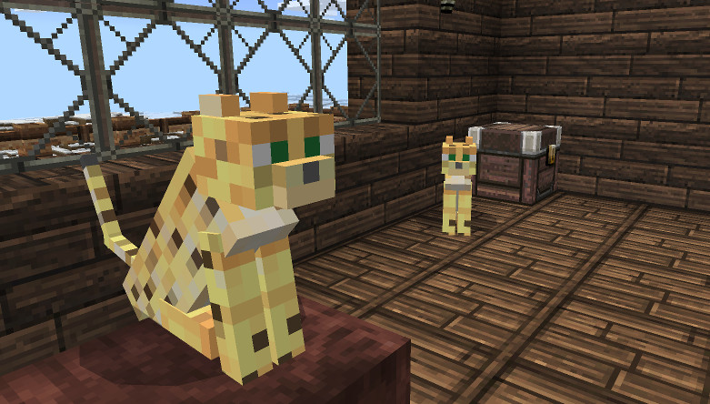

# Ocelots are Cuter Add-on

Have you ever disappointed when you found an amazingly adorable animal
in a jungle, but after taming it the cutest thing somehow morphed into
a completely different creature?

This is an MCPE resource pack which makes ocelots preserve their
texture even after you tamed them. Since it's only a resource pack you
can still get achievements with the add-on activated.

## Tested on
* MCPE v1.0.4.11

## How to build
1. Install the following tools:
 * GNU Autoconf
 * GNU Automake
 * GNU Make
 * Info-Zip [Zip](http://www.info-zip.org/Zip.html)
2. Run `./Build`.
3. Now there should be `mcpe-ocelots-are-cuter-addon-*.mcpack` under
   `_build/data/`.

## Author
PHO &lt;pho [...] cielonegro.org&gt;

## License
[CC0](https://creativecommons.org/share-your-work/public-domain/cc0/)
“No Rights Reserved”
